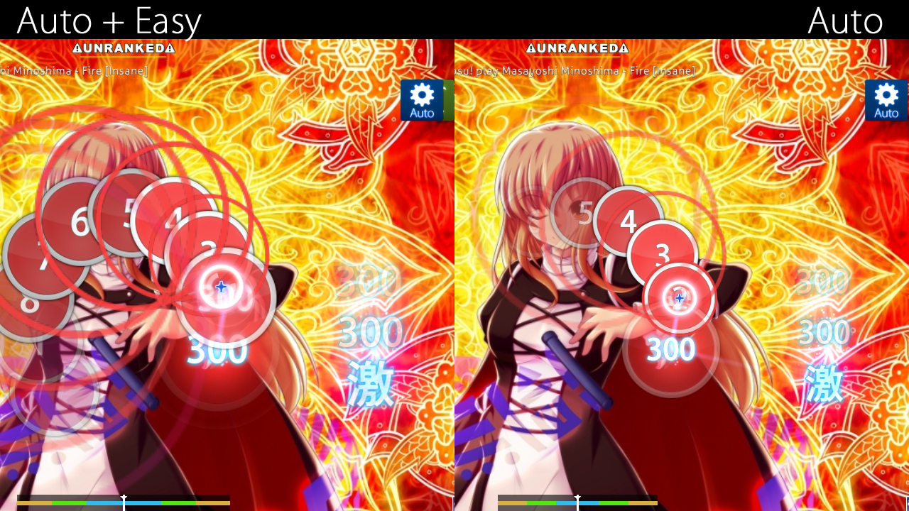
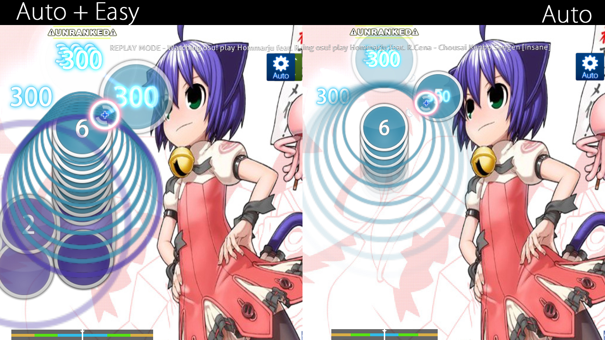
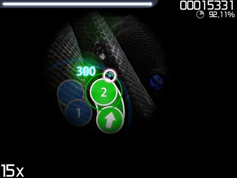
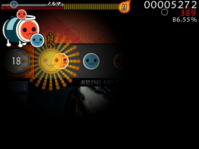
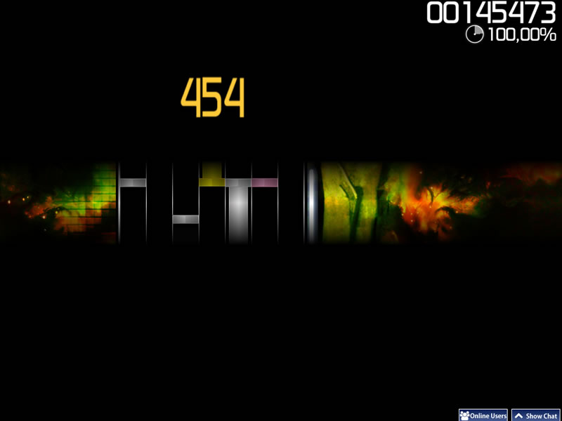
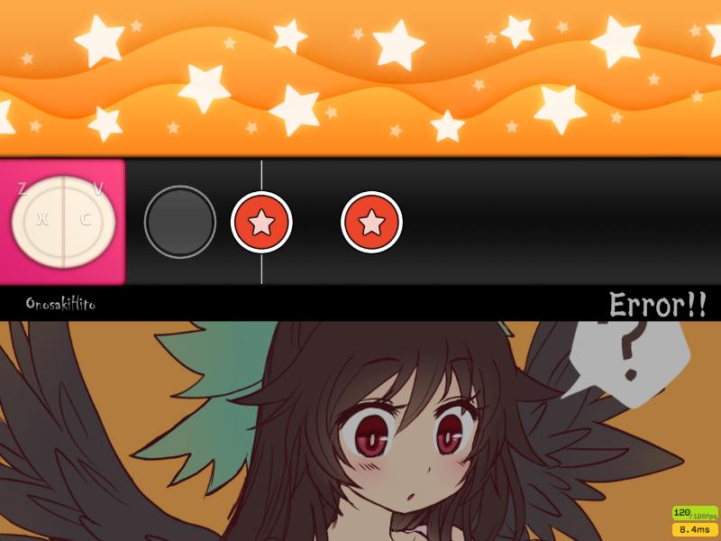
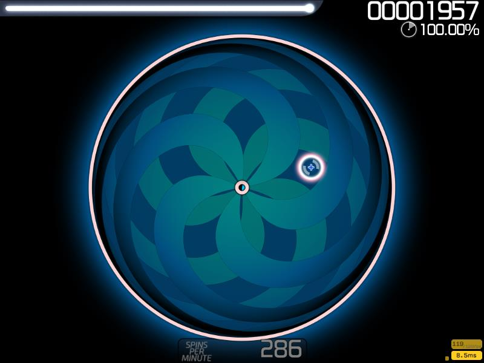
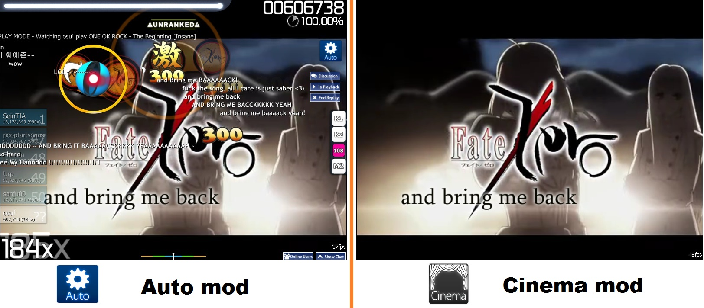
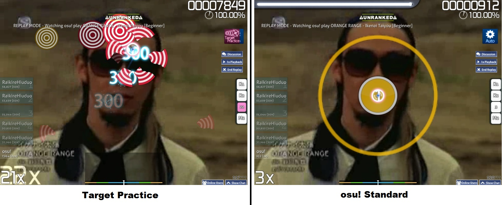
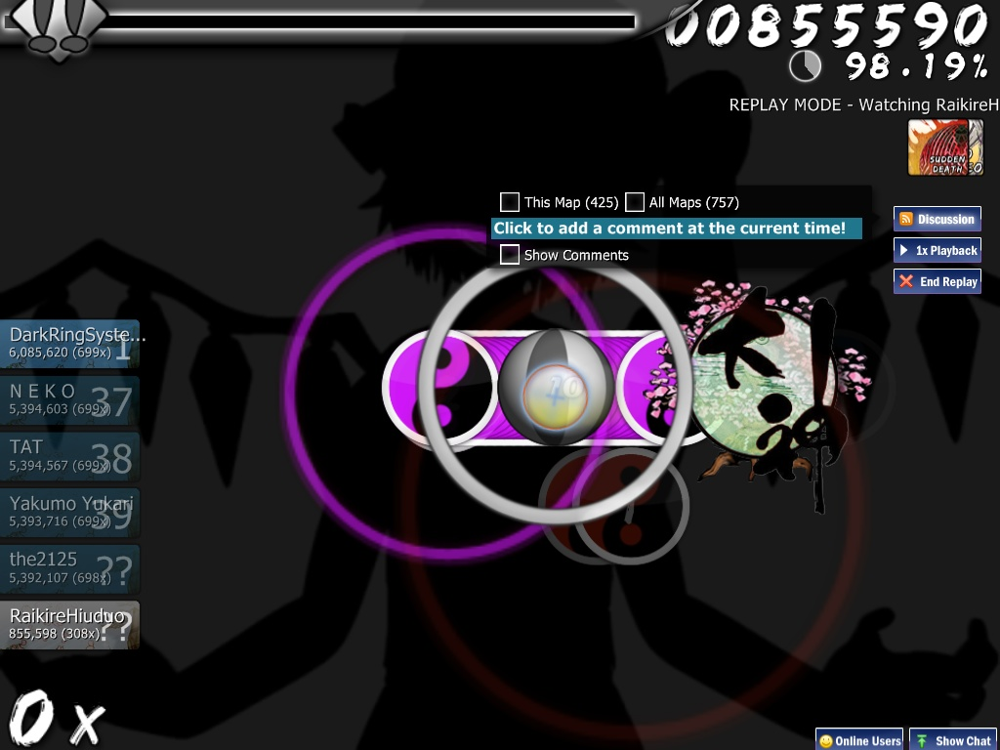

# Modificateurs de jeu

")

Les modificateurs de jeu (mods) sont des modifications optionnelles des éléments et des paramètres d'une carte de rythme que le joueur peut activer à volonté. Un effet de mod peut aller de simples changements de gameplay comme la modification des paramètres de la carte de rythme à l'automatisation comme permettre à osu ! de faire un replay parfait (Auto), sous réserve de changements possibles du multiplicateur de score pour rendre le jeu inclassable. Lorsque plusieurs mods sont activés, le Multiplicateur de score est le produit du Multiplicateur de score des mods activés. Par exemple, lorsque Hidden et Flashlight sont appliqués en même temps, le Multiplicateur de score sera de 1.19x (1.06 * 1.12 = 1.1872 ; 1.19 en arrondissant au centième supérieur).

Les joueurs peuvent changer les raccourcis clavier utilisés pour activer les mods en cliquant sur `Changer les raccourcis clavier` sous l'en-tête `Keyboard` dans le menu Options. Les touches de raccourcis ne fonctionneront que lorsque l'écran de sélection du mod est ouvert.

L'écran de sélection des mods est accessible en appuyant sur `F1` dans l'écran de sélection des morceaux ou en cliquant sur le bouton `Mods` situé dans le coin inférieur gauche de l'écran.

## Réduction des difficultés

Ces mods peuvent faciliter le jeu au prix d'une diminution du multiplicateur de score.

### Easy

")

- Multiplicateur de score : 0.50x
- Touche de raccourci : `Q`

Le mod Easy divise par deux tous les paramètres de difficulté du beatmap sélectionné.

Le mod Easy accorde également au joueur deux " vies " supplémentaires ; si le [life bar](/wiki/Glossary#life-bar) est complètement épuisé, le jeu s'arrête et recharge lentement la barre de vie à environ 80% sans aucun son entre les deux, au prix d'une "vie" du jeu. La recharge est signalée par le son prêt (`readys.wav`) à la place du son typique de fail (`failsound.wav`) pour échouer le beatmap avec une barre de vie vide. Le beatmap reprendra une fois le remplissage réussi signalé par le son de go (`gos.wav`). Le jeu échouera à la place s'il n'y a plus de "vies" quand la barre de vie a été complètement épuisée à nouveau.

Lorsque vous regardez une relecture où une "vie" supplémentaire est utilisée, l'animation de recharge de santé sera ignorée et la relecture se poursuivra comme si vous jouiez avec le mod [No Fail](#no-fail).

Dans le mode [Multi](/wiki/Multi), l'effet des " vies " ne fonctionnera pas dans [Tag Coop / Tag Team Vs](/wiki/Multi#tag-coop-tag-team-vs).

---

- Réduit la difficulté globale - cercles plus grands, drain HP plus indulgent, moins de précision requise.

Dans le mode de jeu [osu!standard](/wiki/Game_mode/osu!), le mode Easy diminue [circle size](/wiki/Beatmap_Editor/Song_Setup#circle-size), [approach rate](/wiki/Beatmapping/Approach_rate) (AR), [overall difficulty](/wiki/Beatmap_Editor/Song_Setup#overall-difficulty) (OD) de même que [HP drain](/wiki/Beatmap_Editor/Song_Setup#hp-drain-rate) (HP); chacun d'entre eux par une quantité énorme (la moitié de la quantité actuelle fixée).

---

- Réduit la difficulté générale - les notes se déplacent plus lentement, moins de précision requise.

Dans le mode de jeu [osu!taiko](/wiki/Game_mode/osu!taiko), le mode Easy diminue le [slider velocity](/wiki/Glossary#slider-velocity) (identique à la réduction de l'AR en mode osu!standard), [overall difficulty](/wiki/Beatmap_Editor/Song_Setup#overall-difficulty) (OD) et [HP drain](/wiki/Beatmap_Editor/Song_Setup#hp-drain-rate) (HP) de moitié. Notez que le nombre de coups requis pour terminer une cuillère tournante est réduit en raison de la réduction de [overall difficulty](/wiki/Beatmap_Editor/Song_Setup#overall-difficulty). Contrairement aux autres modes de jeu, l'exigence d'un score de note réduit pour gagner de la santé dans [osu!taiko](/wiki/Game_mode/osu!taiko) fait que la barre de vie se remplit beaucoup plus rapidement pour remplacer les deux "vies" supplémentaires car il est impossible d'échouer au milieu de la chanson.

---

- Réduit la difficulté globale - cercles plus grands, drain HP plus indulgent, moins de précision requise.

Dans le mode de jeu [osu!catch](/wiki/Game_mode/osu!catch) les effets sont les mêmes qu'en mode osu!standard - tous les fruits tombent plus lentement (même chose que la réduction de l'AR en mode osu!standard), l'appareil photo est zoomé (CS augmenté en mode osu!standard) et deux "vies" supplémentaires sont accordées. Bien qu'ils n'utilisent qu'un seul axe, la taille plus grande des fruits et leur vitesse de chute plus lente peuvent les faire s'agglutiner, créant les mêmes problèmes présumés qu'en mode osu!standard.

---

- Réduit la difficulté globale - un drain HP plus indulgent, moins de précision requise.

Dans le mode de jeu [osu!mania](/wiki/Game_mode/osu!mania) les effets sont les mêmes qu'en mode osu!taiko, sauf que deux "vies" supplémentaires sont accordées, et la vitesse du curseur et le nombre de touches par défaut sont toujours les mêmes.

### No Fail

")

- Multiplicateur de score : 0.50x
- Touche de raccourci : `W`
- Tu ne peux pas échouer, quoi qu'il arrive.

Le mod No Fail rend le joueur incapable d'échouer lorsque le [life bar](/wiki/Glossary#life-bar) atteint zéro.

Si le joueur n'a pas marqué de points pendant la carte, la beatmap échouera à la place, même si l'option No Fail est utilisée.

Notez que l'utilisation du mod No Fail réduit la quantité de [Performance Points](/wiki/Performance_Points) de 10 %. Comme ce mod permet de soumettre des scores avec un ratio miss-to-hit très élevé, jouer de nombreux beatmaps avec ce mod peut considérablement diminuer son [accuracy](/wiki/Accuracy).

### Half Time

")

- Multiplicateur de score : 0,30x (osu!standard, osu!taiko, osu!catch), 0,50x (osu!mania)
- Touche de raccourci : `E`
- Moins de zoom. ("Zoom" se réfère au BPM de la carte de rythme)

Le mod Half Time diminue la vitesse globale du beatmap (BPM) à 75% de l'original, augmente la longueur du morceau de 33%, et diminue AR, OD, et HP d'une petite quantité (signifié par le triangle inversé en exposant).

La méthode utilisée pour ralentir peut faire que la chanson sonne "boueuse" mais les voix peuvent avoir un son similaire.

---

Dans le mode de jeu [osu!taiko](/wiki/Game_mode/osu!taiko), le morceau ralenti et le BPM font que la densité des notes devient plus dense en raison de la diminution de la vitesse d'approche. Cependant, à cause de la façon dont les dendens sont calculés dans osu!taiko, les dendens prennent maintenant plus de coups à effacer et font que *les dendens attribuent une valeur totale plus élevée que sans le mod* (puisque chaque coup de denden n'est pas affecté par le multiplicateur de score, sauf le coup de denden de fin). Cela conduit à une **augmentation** du score maximum possible lorsque le Half Time est activé pour les maps avec des combos très bas et beaucoup de dendens longs, et l'effet est plus significatif lorsque le mod Hard Rock est activé simultanément (ce qui augmente également le nombre de hits requis par denden).

---

Dans le mode de jeu [osu!catch](/wiki/Game_mode/osu!catch), le BPM est abaissé du même facteur que dans les autres modes. Ce mod *aussi* diminue la vitesse du personnage du joueur donc les fruits normaux sans aucun mod *peuvent* se transformer en fruits *hyperdash* en Half Time. De plus, l'indulgence pour les hyperdashes est augmentée, ce qui rend beaucoup plus facile l'arrêt sous le prochain fruit lors d'un hyperdash.

## Difficulté croissante

Ces mods introduisent de nouveaux éléments pour rendre le jeu plus difficile et récompenser le joueur en termes d'augmentation du Multiplicateur de Score.

### Hard Rock

")

- Multiplicateur de score : 1,06x (osu!standard, osu!taiko), 1,12x (osu!catch), 1,00x (osu!mania ; non classé)
- Touche de raccourci : `A`
- Tout est devenu un peu plus difficile...

Hard Rock (nommé d'après la difficulté la plus difficile du jeu DS [Elite Beat Agents](/wiki/Glossary#eba)) soulève [circle size](/wiki/Beatmap_Editor/Song_Setup#circle-size) de 30% et le reste des paramètres de difficulté de 40%.

---

.")

Dans le mode de jeu [osu!standard](/wiki/Game_mode/osu!), Hard Rock retourne également le beatmap sur l'axe X, de sorte que les éléments qui étaient en bas de la carte sont maintenant en haut et vice versa.

---

Dans le mode de jeu [osu!taiko](/wiki/Game_mode/osu!taiko) Le mod Hard Rock augmente [slider velocity](/wiki/Glossary#slider-velocity) de même que [overall difficulty](/wiki/Beatmap_Editor/Song_Setup#overall-difficulty). C'est le mod le plus utilisé dans osu!taiko car c'est la seule difficulté à augmenter le mod qui ne nécessite pas de mémorisation ou de frappe super rapide sur les maps hard/insane.

Notez que le nombre de coups requis pour terminer un denden est augmenté en raison de l'augmentation de la difficulté globale. Par conséquent, le score maximum possible de difficultés osu!taiko avec Hard Rock on est plus élevé que celui du mod. Cependant, cet effet est insignifiant dans la plupart des cas car chaque hit en denden donne un score statique de 300, ce qui est encore plus petit qu'une différence de score typique entre un GRAND hit et un BON hit (550 points à 100 combo ou plus).

---

.")

Dans le mode de jeu [osu!catch](/wiki/Game_mode/osu!catch) Le mod Hard Rock dispose d'une multitude d'effets. En plus de rendre le personnage du joueur et les fruits plus petits (CS) et d'augmenter leur vitesse de chute (AR), ce mod peut faire dévier légèrement les fruits ordinaires vers la gauche ou la droite de leur emplacement sur la grille, obligeant le joueur à faire des mouvements plus chaotiques et à utiliser l'hyperlien.

Comme ce mod augmente la difficulté de façon énorme par rapport aux deux autres modes, il vaut un multiplicateur de 1,12x plutôt que de 1,06x.

---

Dans le mode de jeu [osu!mania](/wiki/Game_mode/osu!mania) seulement la difficulté de jugement (OD) et les valeurs de [approach rate](/wiki/Beatmapping/Approach_rate) (AR) sont augmentées.

Le mod Hard Rock n'affectera pas le placement des notes. Pour les mods qui modifient le placement des notes, voir [Random](#random) mod sous Spécial.

L'utilisation de ce mod sur osu!mania entraînera un jeu non classé.

### Sudden Death

")

- Multiplicateur de score : 1.00x
- Touche de raccourci : `S` (à partir de non sélectionné)
- Manquer une note et échouer.

Le mod Sudden Death fait échouer la carte au joueur si le [combo](/wiki/Glossary#combo) est jamais cassé, ce qui entraîne un chiffre manquant très important (mode osu!standard uniquement) et un drain HP complet.

Le combo peut être rompu en manquant une note, en ne cliquant pas sur un cercle de départ (osu!standard seulement), en ne collectant pas une coche de curseur, ou en ne complétant pas un spinner. Cependant, le combo ne sera pas cassé en manquant une fin de curseur (résultat en obtenant une valeur de 100 points à la place pour cette fin de curseur ; osu!standard seulement) ou en ne tenant pas/en collectant sur le chemin de curseur vide.

#### Perfect

")

Cliquez à nouveau sur Sudden Death pour activer le mod Perfect.

- Multiplicateur de score : 1.00x
- Touche de raccourci : `SS` (à partir de non sélectionné) ou `Shift`+`S`
- SS ou abandonner.

Le mod perfect fait en sorte que *tout* hit imparfait (comme dans, toute valeur de score qui ne donne pas 100% de précision) soit compté comme un **miss** et va **forcer le redémarrage automatique du morceau**, ce que ne fait pas Sudden Death.

Bien que ce mod ne donne pas de Multiplicateur de score, il est *plus impitoyable* (précision de 100% ou redémarrage automatique forcé jusqu'à ce que le joueur abandonne en quittant le beatmap manuellement) par rapport à la Mort Subite (tant que le combo n'a pas cassé). Il n'y aura pas d'écran raté et si la beatmap a un prologue sautable, elle sera jouée *à nouveau* puisque le mod Perfect utilise la fonctionnalité de redémarrage (et non de redémarrage rapide) au moment où un échec (selon le standard de Perfect) est donné.

---

Dans le mode de jeu [osu!mania](/wiki/Game_mode/osu!mania), Le mod Perfect accepte à la fois le Rainbow 300/MAX (la valeur de score la plus élevée) et les valeurs de score 300 comme valeurs de score légitimes puisque les deux donnent un score de précision de 100% et tout le reste comme manqué.

### Double Time

")

- Multiplicateur de score : 1.12x (osu!standard, osu!taiko) , 1.06x (osu!catch), 1.00x (osu!mania)
- Touche de raccourci : `D` (à partir de non sélectionné)
- Zoooooooooom

Le mod Double Time augmente la vitesse globale du beatmap (BPM) à 150% de l'original, réduisant la longueur du morceau de 33%, et augmente AR, OD, et HP d'une petite quantité (signifié par le triangle en exposant).

La méthode utilisée pour augmenter la vitesse n'augmente pas la hauteur de la chanson, mais peut la faire sonner "boueuse".

---

Dans le mode de jeu [osu!taiko](/wiki/Game_mode/osu!taiko), puisque la clémence de frappe est considérablement réduite en plus de la difficulté globale déjà stricte de osu!taiko, ainsi que les tics de glissement étant considérablement plus difficiles à frapper (et réduisant la valeur des dendens), Double Time est généralement considéré comme le mod le plus dur dans osu!taiko et est rarement utilisé.

---

Dans le mode de jeu [osu!catch](/wiki/Game_mode/osu!catch), Comme il n'y a pas de difficulté globale à augmenter, ce mod ne fait rien d'autre qu'un multiplicateur de BPM et de taux d'approche et ne vaut donc qu'un multiplicateur de 1,06x. A l'opposé de Half Time, cependant, Double Time diminue grandement l'indulgence des hyperdashes, rendant les fruits nécessitant des hyperdashes presque impossibles à attraper dans certains cas.

#### Nightcore

")

Cliquez à nouveau sur Double Time pour activer le mod Nightcore.

- Multiplicateur de score : 1,12x (osu!standard, osu!taiko) , 1,06x (osu!catch), 1,00x (osu!mania).
- Touche de raccourci : `DD` (à partir de non sélectionné) ou `Shift`+`D`
- uguuuuuuuu

Le mod Nightcore augmente la tonalité et ajoute une piste de batterie au fond qui (en 4/4 temps) va dans l'ordre de la grosse caisse sur les temps 1 et 3, tape sur les temps 2 et 4, et crash sur le temps 1 toutes les 4 mesures.

Le multiplicateur reste le même, et le beatmap lui-même n'est pas affecté au-delà de ce que ferait le Double Time car **Double Time sera automatiquement activé afin d'utiliser le mod** Nightcore.

### Hidden

")

- Multiplicateur de score : 1,06x (osu!standard, osu!taiko, osu!catch) , 1,00x (osu!mania)
- Touche de raccourci : `F`

Le mod Hidden (débuté dans Ouendan 2, le deuxième jeu japonais sur DS) supprime les cercles d'approche et fait disparaître les objets touchés après leur apparition à l'écran.

Si le beatmap a été passé avec la note S ou SS avec le mod Hidden activé, le beatmap attribuera la variante sliver de la note à la place.

---

- Jouez sans cercles d'approche et sans notes fondues pour un léger avantage de score.

Dans le mode de jeu [osu!standard](/wiki/Game_mode/osu!), il élimine les cercles d'approche et fait disparaître les objets touchés peu après leur apparition, obligeant les joueurs à mémoriser plus ou moins le timing et, dans une moindre mesure, le placement et la trajectoire du curseur.

Par défaut, le premier objet touché aura un cercle d'approche. Cependant, ce comportement peut être désactivé en toute sécurité dans les Options sous les Généralistes de Jeu comme `Afficher le cercle d'approche sur le premier objet en "Hidden"`.

---

- Les notes s'effacent avant que vous ne les frappiez !

Dans le mode de jeu [osu!taiko](/wiki/Game_mode/osu!taiko), les notes s'effacent environ à la moitié de l'écran, ce qui exige que le joueur se souvienne du timing et de la couleur. Cependant, les curseurs et les dendens traversent toujours la ligne de temps complète et ne s'éteignent pas, sauf que le denden n'a pas de cercle d'approche pour indiquer le moment où il s'éteint. Sur une carte de rythme avec une difficulté globale élevée, Hidden est utilisé par les joueurs expérimentés pour augmenter le score au lieu de Hard Rock, parce que le Hard Rock rend parfois la fenêtre de temps trop petite.

---

- Jouez sans cercles d'approche et sans notes fondues pour un léger avantage de score.

Dans le mode de jeu [osu!catch](/wiki/Game_mode/osu!catch), Hidden fait que les fruits s'effacent environ à mi-chemin sur l'écran.

---

Cliquez à nouveau sur Fade In pour activer le mode Hidden.

- Touche de raccourci : `FF` (à partir de non sélectionné) ou `Shift`+`F` (osu!mania seulement)
- Les notes s'effacent avant que vous ne les frappiez !

")

Dans le mode de jeu [osu!mania](/wiki/Game_mode/osu!mania), Hidden peut être utilisé en appuyant à nouveau sur le mod Fade In, et fonctionne comme l'inverse du Fade In.

#### Fade In

")

- **osu!mania only**
- Multiplicateur de score : 1.00x (osu!mania seulement)
- Touche de raccourci : `F`

")

Le mode Fade In provoque un fondu enchaîné des notes à l'approche de la barre de jugement.

La vitesse à laquelle elles s'effacent est basée sur le combo, un combo plus élevé entraînant un fondu plus tardif des notes qui restent invisibles plus longtemps. La taille du fondu ne s'arrête que lorsque le seuil de 500 combo (couvrant environ 70 % du terrain de jeu) est atteint. Le fondu sera ramené à la taille 0 combo (couvre environ 20% du terrain de jeu) lorsque le combo sera cassé.

Si le beatmap a été passé avec la note S ou SS avec le mod Fade In activé, le beatmap attribuera à la place la variante sliver de la note.

### Flashlight

")

- Multiplicateur de score : 1,12x (osu!standard, osu!taiko, osu!catch), 1,00x (osu!mania)
- Touche de raccourci : `G`
- Zone de vue restreinte.

Le mode lampe de poche limite et réduit la surface visible de l'écran.

Si le beatmap a été passé avec la note S ou SS avec le mod Flashlight activé, le beatmap attribuera la variante sliver de la note à la place.

---

Dans le mode de jeu [osu!standard](/wiki/Game_mode/osu!), seul un petit cercle éclairé (zone visible) entourant le curseur est affiché, ce qui permet de visualiser le champ de jeu limité et les objets touchés. La zone visible devient plus petite à 100 combo et à nouveau à 200 combo ; elle revient à sa taille originale si le combo est cassé. Lorsque vous tenez la boule glissante sur une trajectoire de glissière, la zone visible s'assombrit également jusqu'à ce que la glissière soit terminée.

Lorsqu'elle est associée au mod Hidden, la zone visible de la Flashlight importe peu (avec une vision limitée, le fondu des objets touchés peut se produire alors que le curseur n'est pas focalisé sur le point d'apparition de l'objet touché) et peut nécessiter que le joueur mémorise la totalité du beatmap.

---

Dans le mode de jeu [osu!taiko](/wiki/Game_mode/osu!taiko), la position de la zone visible est fixée à la zone de frappe. La zone visible se rétrécit aux mêmes intervalles de combo qu'en mode osu!standard (à 100 et 200 combo) ; elle revient à sa taille d'origine si le combo est cassé.

Lorsqu'elle est associée à Hidden, la zone visible de la Flashlight devient un point discutable puisque les notes sont techniquement *invisibles* (les notes s'effacent complètement lorsqu'elles atteignent la zone visible, même à la taille de la zone visible du combo 0) et exige que le joueur mémorise plutôt la totalité du beatmap.

---

Dans le mode de jeu [osu!catch](/wiki/Game_mode/osu!catch) le comportement du mode Flashlight est le même que celui du mode osu!standard, sauf que la zone visible suit le receveur à la place. La zone visible est nettement plus grande qu'en mode osu!standard ou en mode osu!taiko mais reste un défi car elle empêche entièrement le joueur de voir les notes en haut ou de l'autre côté de l'écran.

Lorsqu'il est associé à Hidden, les fruits sont visibles momentanément si le receveur est *directement sous* les fruits jusqu'à ce qu'il atteigne le combo 100, moment auquel les fruits deviennent invisibles au moment où les fruits atteignent la zone visible et nécessite la mémoire du joueur du motif de la beatmap pour effacer la beatmap à la place.

---

Dans le mode de jeu [osu!mania](/wiki/Game_mode/osu!mania), La zone visible est limitée à une barre horizontale relativement mince au centre de l'écran, tout le reste étant obstrué.

## Spécial

Les mods listés ci-dessous ne peuvent pas être utilisés conjointement, sauf pour Relax, Spun Out, et ScoreV2. De plus, Auto ne peut pas être utilisé avec Sudden Death/Perfect.

Seule l'utilisation de Relax, Pilote automatique, ou Auto/Cinéma ne sauvegardera pas le replay et le score dans le classement local après avoir quitté l'écran des résultats. Cependant, le joueur peut exporter le replay puis le charger dans le client osu ! fera apparaître le play sur le tableau local du beatmap avec les mods spécifiés affichés.

### Relax

")

- **osu!standard, osu!taiko, et osu!catch uniquement**
- Multiplicateur de score : 0.00x (osu!standard, osu!taiko, osu!catch ; non classé)
- Touche de raccourci : `Z`

---

- Tu n'as pas besoin de cliquer.
- Laissez votre doigt cliqueter/taper loin de la chaleur des choses.
- \*\* NON CLASSÉ \*\*

Dans le mode de jeu [osu!standard](/wiki/Game_mode/osu!), le joueur n'a qu'à passer le curseur sur les objets touchés et les objets touchés seront touchés avec un timing parfait (ou toute autre valeur de score ultérieure si le joueur atteint l'objet touché en retard).

Le mod Relax cache également le score, le combo et les ratés (sauf dans osu!taiko) et rend impossible l'échec de la map, tout comme le fait le mod No Fail. De plus, la valeur des spins par minute sera doublée, ce qui permettra au joueur de tourner plus vite et d'obtenir un score plus élevé qu'en jeu normal.

---

- Du calme ! Vous ne serez plus étourdis par des roulements de tambour à la manière des ninjas, des roulements de tambour exigeants ou des katu inattendus.
- \*\* NON CLASSÉ \*\*

Dans le mode de jeu [osu!taiko](/wiki/Game_mode/osu!taiko), Le mode Relax supprime le jugement de la couleur ; la couleur correcte pour la note est frappée quelle que soit la couleur donnée, un timing indulgent pour collecter les tics des curseurs pendant les roulements de tambour, et les dendens peuvent être effacés avec n'importe quelle séquence de couleurs au lieu d'alterner la séquence de couleurs. La mascotte animée sera également supprimée dans le mod Relax.

---

- Utilisez la souris pour contrôler le receveur.
- \*\* NON CLASSÉ \*\*

Dans le mode de jeu [osu!catch](/wiki/Game_mode/osu!catch), Le mod Relax permet de déplacer le personnage librement à n'importe quelle vitesse avec la souris.

---

Le mod Relax n'est pas disponible pour une utilisation dans [osu!mania](/wiki/Game_mode/osu!mania).

### Auto Pilot

")

- **osu!standard seulement**
- Multiplicateur de score : 0.00x (osu!standard seulement ; non classé)
- Touche de raccourci : `X`
- Mouvement automatique du curseur - il suffit de suivre le rythme.
- \*\* NON CLASSÉ \*\*

Le mod Auto Pilot prendra le contrôle du mouvement du curseur et se déplacera systématiquement vers le centre exact du prochain objet touché, laissant le timing de l'objet touché au joueur.

Le mod Auto Pilot cache également le score, le combo et les ratés et rend impossible les ratés de la carte, tout comme le fait le mod No Fail. De plus, la valeur des spins par minute effectuée par le pilote automatique est similaire à celle du mod Spun Out et le joueur ne peut pas augmenter le nombre de spins par minute en le faisant tourner (le spinner sera assombri et ne lira pas les spins effectués par le joueur).

---

Auto Pilot n'est pas disponible pour une utilisation dans [osu!taiko](/wiki/Game_mode/osu!taiko), [osu!catch](/wiki/Game_mode/osu!catch), ou [osu!mania](/wiki/Game_mode/osu!mania).

### Spun Out

")

- **osu!standard seulement**
- Multiplicateur de score : 0.90x (osu!standard seulement)
- Touche de raccourci : `C`
- Les spins seront automatiquement remplis

Le mod Spun Out effacera tous les spinner de la beatmap à 286 tours par minute (la moitié des 477 tours par minute de Auto) en rotation dans le sens des aiguilles d'une montre.

Les spins seront désactivés et le joueur ne pourra pas tourner pour augmenter la valeur des spins par minute.

---

Spun Out n'est pas disponible pour une utilisation en [osu!taiko](/wiki/Game_mode/osu!taiko), [osu!catch](/wiki/Game_mode/osu!catch), ou [osu!mania](/wiki/Game_mode/osu!mania).

### Auto

- Multiplicateur de score : 1.00x (non classé)
- Touche de raccourci : `V` / Maintenir `Ctrl` lors de la sélection d'un beatmap
- Regardez une lecture automatique parfaite tout au long de la chanson

Le mode automatique permet au joueur de voir un playthrough parfait de la carte de rythme sélectionnée.

Ce mod fonctionne exactement comme un [replay](/wiki/Replay), permettant d'utiliser une vitesse de 2x/0,5x et de voir et de commenter le beatmap. Le mod Auto obtiendra toujours un SS (100% de précision) sauf dans des cas particuliers.

Comme le joueur ne joue pas activement la carte de rythme et plus à regarder la relecture, le jeu est considéré comme non classé.

---

Dans le mode de jeu [osu!standard](/wiki/Game_mode/osu!) le mode Auto tournera rapidement jusqu'à un maximum de 477 tours par minute en rotation anti-horaire pour les toupies.

---

Dans le mode de jeu [osu!taiko](/wiki/Game_mode/osu!taiko) le mode Auto tentera une lecture parfaite. Il manquera occasionnellement un tic-tac sur les roulements de tambour qui ne démarrent pas sur un temps complet ou un demi temps et ne pourra pas toujours terminer les dendens sur les cartes avec une difficulté globale très élevée.

---

Dans le mode de jeu [osu!catch](/wiki/Game_mode/osu!catch) le mode Auto va même au-delà de la perfection et utilise une vitesse illimitée pour attraper *chaque* banane dans un spinner, bien qu'il soit impossible pour un joueur humain.

---

Dans le mode de jeu [osu!mania](/wiki/Game_mode/osu!mania), le mod Auto tentera une lecture parfaite, mais peut rater des notes densément empilées (par exemple, plusieurs pressions de touche rapprochées sur une barre de maintien).

#### Cinema

Cliquez à nouveau sur Auto pour activer le mode Cinéma.

- Multiplicateur de score : 1.00x (non classé)
- Touche de raccourci : `VV` (de non sélectionné) / `Shift`+`V` / Maintenir `Ctrl`+`Shift` lors de la sélection d'un beatmap

Le mod Cinema montre uniquement le **background et le storyboard** sans les éléments de gameplay.

Les sons peuvent toujours être entendus en fonction du plan de battement sélectionné. De plus, les éléments de lecture et l'écran Résultats seront désactivés et la luminosité du fond sera réglée à 0 %.

Comme le joueur ne joue pas activement la carte de rythme et plus à regarder la relecture, le jeu est considéré comme non classé.

### xK

- **osu!mania uniquement**
- Multiplicateur de score : 0.66x ~ 1.00x (osu!mania seulement ; varie)
- Touche de raccourci : `Z` (chaque clic va de 4K à 9K puis de nouveau à 1K jusqu'à 3K et enfin désactivé)

Ce mod va forcer tous les beatmaps *convertis* osu!mania à utiliser le paramètre K sélectionné, ignorant le paramètre K supposé du beatmap au prix d'une diminution du multiplicateur de score en fonction de la différence K.

Le multiplicateur de score ne s'applique que dans ces conditions :

- L'utilisation d'un mod de 1K, 2K ou 3K entraînera un jeu non classé.
- La table n'affecte que les beatmaps convertis du mode osu!standard au mode osu!mania.
- Le mod ne fonctionne pas sur les beatmaps spécifiques à osu!mania.

| Défaut/Modificateur | 1k | 2k | 3k | 4k | 5k | 6k | 7k | 8k | 9k |
| :-: | :-: | :-: | :-: | :-: | :-: | :-: | :-: | :-: | :-: |
| 4k | 0.78 | 0.82 | 0.86 | - | 0.90 | 0.90 | 0.90 | 0.90 | 0.90 |
| 5k | 0.74 | 0.78 | 0.82 | 0.86 | - | 0.90 | 0.90 | 0.90 | 0.90 |
| 6k | 0.70 | 0.74 | 0.78 | 0.82 | 0.86 | - | 0.90 | 0.90 | 0.90 |
| 7k | 0.66 | 0.70 | 0.74 | 0.78 | 0.82 | 0.86 | - | 0.90 | 0.90 |

### Co-Op

- **osu!mania only**
- Multiplicateur de score : 0.70x ~ 1.00x (osu!mania seulement ; non classé)
- Touche de raccourci : -
- Doublez le montant de la clé, doublez le plaisir !

 et le Co-Op (à droite) pour le beatmap osu!mania-spécifique (en haut) et non-spécifique (en bas).")

[Introduit dans la construction du 05 mars 2015 (2015-03-05) \[b20150305 (Stable)\]](https://osu.ppy.sh/home/changelog), Le mod Co-Op introduit un second terrain de jeu avec un second jeu de contrôles basé sur le nombre de xK actuel (7K -> 7K + 7K = 14K). Pour les maps spécifiques à osu!mania, le xK est divisé en deux (7K -> 4K + 3K = 7K).

Le multiplicateur de score ne s'applique que dans ces conditions :

- L'utilisation du mod Co-Op entraînera un jeu non classé.
- La table n'affecte que les beatmaps convertis du mode osu!standard à osu!mania avec le mod Co-Op activé.
- Le mod Co-Op ne donne **aucune** pénalité sur les beatmaps spécifiques à osu!mania.

| Par défaut | 1k | 2k | 3k | 4k | 5k | 6k | 7k | 8k | 9k |
| :-: | :-: | :-: | :-: | :-: | :-: | :-: | :-: | :-: | :-: |
| 4k | 0.82 | - | 0.90 | 0.90 | 0.90 | 0.90 | 0.90 | 0.90 | 0.90 |
| 5k | 0.78 | 0.86 | 0.90 | 0.90 | 0.90 | 0.90 | 0.90 | 0.90 | 0.90 |
| 6k | 0.74 | 0.82 | - | 0.90 | 0.90 | 0.90 | 0.90 | 0.90 | 0.90 |
| 7k | 0.70 | 0.78 | 0.86 | 0.90 | 0.90 | 0.90 | 0.90 | 0.90 | 0.90 |

Une explication détaillée sur le deuxième terrain de jeu se trouve sur la page [osu!mania avec Co-Op](/wiki/Game_mode/osu!mania#co-op).

### Random

")

- **osu!mania only**
- Multiplicateur de score : 1.00x (osu!mania seulement ; non classé)
- Touche de raccourci : `X`
- Mélangez les notes !

, Random only (au milieu), et Random with Co-Op (à droite) pour le beatmap osu!mania spécifique (en haut) et non spécifique (en bas).")

Le mod aléatoire va **randomiser le placement des notes** uniquement.

Il n'affecte pas la timeline des notes et n'est pas mélangé à chaque fois que le mod Random est utilisé.

### ScoreV2

- Multiplicateur de score : 1.00x (non classé)
- Touche de raccourci: -
- Essayez le futur système de notation.
- \*\* NON CLASSÉ \*\*

[Introduit dans la construction du 22 février 2017 (2017-02-22) \[b20170222.3 (Stable)\]](https://osu.ppy.sh/home/changelog), Le mod ScoreV2 utilise le système prototype ScoreV2 au lieu du système de notation actuel utilisé par le mode. Le système ScoreV2 tente de mettre à l'échelle les valeurs de score de *tous* les objets touchés jusqu'à une limite de 1 000 000 (1 million) de points avec un modificateur de score de 1,00, en excluant la valeur de spinner bonus des spinners en mode osu!standard, des dendens en mode osu!taiko, et des bananes collectées (équivalent spinner) en mode osu!catch.

Des informations complètes concernant ScoreV2 peuvent être trouvées à [the Score page under ScoreV2](/wiki/Score#scorev2).

## Expérimental

**Notice:** Ces mods n'apparaissent pas dans la version `Stable` en raison de leur nature expérimentale. Procédez à vos propres risques.

### Spécial

#### Target Practice

")

- **osu!standard seulement**
- Multiplicateur de score : 1.00x (non classé, osu!standard seulement)
- Touche de raccourci : ?
- ?

Le mod Target Practice supprime tous les objets touchés cartographiés et les remplace par un jeu "Target Practice" simplifié et cohérent.

Le jeu se termine immédiatement si le joueur n'a pas réussi à toucher une seule fois l'une des cibles.

## Autres

### Mods inversés

Tous les mods ne peuvent pas être appliqués en même temps. Certains mods sont l'inverse d'autres et seront désactivés si le mod inverse est sélectionné.

Ce sont quelques exemples notables :

- Hard Rock est l'inverse de Easy
- La Mort Subite / Parfaite est l'inverse de Pas d'échec, Relax, Pilote Automatique et Auto/Cinéma
- Double Time / Nightcore est l'inverse de Half Time

### Unranked

Tous les mods spéciaux (sauf 4K, 5K, 6K, 7K, 8K, 9K et Spun Out) feront en sorte que tout jeu avec eux activé sera **non classé** et non éligible pour être ajouté aux statistiques classées ou en ligne.

## Supprimé

Ces mods ont été utilisés il y a quelque temps, mais reposent maintenant ici en paix.

### 10K

- **osu!mania uniquement**
- Multiplicateur de score : 0.90x (osu!mania seulement)
- Touche de raccourci : `Z` (de 9K)

Ce mod permettait au joueur d'utiliser 10 touches pour un seul terrain de jeu dans osu!mania.

### Fade Out

")

- **osu!mania only**
- Multiplicateur de score : 1.00x (osu!mania seulement, non classé).
- Touche de raccourci : `FF` (à partir de non sélectionné) ou `Shift`+`F` (osu!mania seulement)
- Les notes s'effacent avant que vous ne les frappiez !

[Voir le mod Hidden pour osu!mania pour la fonctionnalité Fade Out](#hidden).

### No Video

- Multiplicateur de score : 1.00x
- Touche de raccourci : -
- Un mod pratique pour désactiver temporairement la vidéo lorsque cela est nécessaire.

Le mod No Video désactive la vidéo de fond du beatmap.

La fonctionnalité du mod a été déplacée vers [Visual Settings](/wiki/Visual_Settings) et l'icône n'est plus utilisée.

## Anecdotes

- osu ! permet d'arrondir le multiplicateur de score au centième près (0,01). Heureusement, un patch a corrigé le problème d'arrondi en arrondissant à la hausse si la valeur en millièmes est de 0,005 ou plus et à la baisse sinon.
- Certains (sinon, la plupart) affirment que le mod Easy ne parvient pas à rendre les beatmaps plus faciles à jouer. L'argument est que les cercles deviennent comiquement grands, et que la RA devient ridiculement plus lente. Le mod a le potentiel de rendre l'aire de jeu beaucoup plus encombrée et plus difficile à lire, surtout sur les beatmaps les plus difficiles.
  - Ces points sont développés dans [Let's talk Easy Mod](https://osu.ppy.sh/community/forums/topics/56606) pour améliorer le mod, par [Lybydose](https://osu.ppy.sh/users/64501).
- Lorsque vous jouez avec le mod Sudden Death activé dans le mode osu!standard, il y a *de rares cas* où le joueur *peut* survivre à un drain de barre de vie complète pour casser le compte des combo. Si le joueur a réussi à préserver au moins une partie de sa santé en obtenant une tique de glissement dans une marge de temps très courte juste après que le combo se soit cassé et *avant* que la barre de vie soit complètement vidée, le joueur peut continuer à jouer la beatmap telle quelle et aucune grande figure de miss ne sera imposée.
  - Comme le gain de santé du tick coulissant doit être suffisant pour survivre à la perte de santé naturelle au fil du temps, il peut être impossible de continuer à des niveaux de difficulté plus élevés même si le joueur survit à la perte totale de la barre de vie.
- [Nightcore est né d'une blague des April Fools.](https://osu.ppy.sh/community/forums/topics/49733)
- Le mod Flashlight a été soumis à une forte controverse concernant son implémentation en 2010 car le fait d'être le mod le plus *faible* à pirater a forcé le mod à être déclassé jusqu'à ce qu'un patch soit implémenté pour couvrir la faille d'implémentation de Flashlight. De plus amples informations concernant cet incident peuvent être trouvées dans les deux fils de discussion ci-dessous.
  - [La lampe de poche est de retour !](https://osu.ppy.sh/community/forums/topics/41519)
  - [Mode lampe de poche désactivé #2](https://osu.ppy.sh/community/forums/topics/41039)
- En utilisant le mod Co-Op, il est tout à fait possible d'augmenter le nombre de clés à *18 Keys* (mod 9K -> 9K + 9K = 18K, appliqué uniquement aux difficultés non spécifiques).
