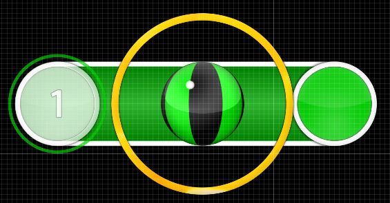

# Éléments d'une beatmap

Il existe trois principaux **objets** sur osu!, qui constituent l'intégralité du gameplay. Les cercles et les sliders sont très fréquents tandis que les spinners sont plus rares.

## Cercle

Appelé "marqueur" sur les [jeux Nintendo DS](/wiki/Game_mode/osu!), il s'agit d'un cercle coloré avec un nombre dessus, à l'intérieur d'un second cercle plus grand nommé **cercle d'approche** qui rétrécit petit à petit. Lorsque le cercle d'approche entre en contact avec le cercle lui-même, le joueur doit cliquer sur ce cercle. Il gagne ainsi un certain nombre de points (300, 100, 50 ou rien en fonction de la précision) et un bonus à sa barre de vie. Il recevra un bonus plus important si le cercle se situe à la fin d'un combo.

## Slider

Un slider est constitué de deux cercles reliés entre eux par un chemin défini. Un cercle d'approche entoure le premier cercle du slider. Tout comme pour le cercle seul, le joueur doit appuyer en rythme sur le premier cercle et se diriger (toujours en rythme) vers l'autre cercle sans relâcher le bouton de sa souris, en suivant le chemin. Pour le guider, un élément graphique appelé « **slider ball** » (une balle) suit le chemin en même temps. Cette balle est elle-même entourée d'un « **slider ring** » (un anneau) qui suit la balle en permanence. Si le joueur, censé suivre la balle avec sa souris, sort de l'anneau, son multiplicateur de combo est remis à zéro.

Parfois, à la fin d'un slider, un « **reverse arrow** » ("flèche de retour") est placée. Il s'agit d'une flèche qui indique au joueur que la balle va faire demi-tour pour revenir au début du cercle. Le joueur ne doit pas relâcher le bouton de sa souris avant qu'elle n'arrive au bout. Notez qu'il peut y avoir autant de flèches que le mappeur le souhaite.

Les « **slider ticks** » sont de petits points placés sur le slider à des intervalles réguliers (suivant le BPM de la musique). Le joueur ne peut perdre son multiplicateur de combo que s'il est hors du slider ring au moment précis où la balle passe sur le slider tick, ce qui veut dire que si le joueur n'est pas à l'intérieur du slider ring pendant que la balle n'est pas sur un slider tick, aucune pénalité n'est infligée au joueur.

À chaque fois que le joueur passe sur un slider tick, il gagne 10 points.

## Spinner

Un spinner est un cercle qui prend toute la zone de jeu. Il possède un « **spinner metre** » sur ses côtés. Lorsque ce dernier est rempli, le joueur gagne des points ; on dit alors que le spinner est **complété**. Le spinner dispose aussi d'un cercle d'approche, mais il ne fonctionne pas comme avec les autres objets. En effet, il détermine le temps restant avant que le spinner se termine (lorsqu'il touche son centre). Dès qu'il apparaît, le joueur doit tourner autour du centre le plus vite possible pour le compléter. Le nombre de tours pour compléter un spinner dépend de sa durée. Si le joueur fait tourner le spinner, même s'il ne le complète pas, il gagne des points quand même. S'il réussit à le compléter, il gagne des points bonus (par tranche de 1000) et sa vie ne descend plus tant qu'il continue à tourner. Il gagnera aussi 300 points à la fin du spinner.

Si le joueur gagne 100 ou 50 points à la fin du spinner, c'est qu'il a **semi-complété** ce dernier. Son multiplicateur de combo n'est pas réinitialisé et il ne reçoit pas de pénalité.

Un indicateur de la vitesse de tournoiement est aussi affiché en bas de l'écran. Il donne un nombre en tours par minute.

**Note :** sur le nouveau skin par défaut d'osu!, les spinners n'ont pas de cercle d'approche ni de spinner metre ; seules sa forme et sa couleur peut aider le joueur à déterminer le statut du spinner.
